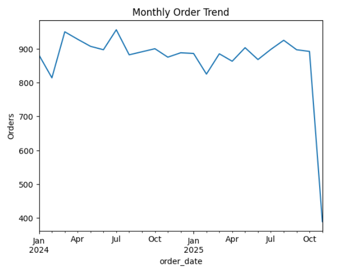
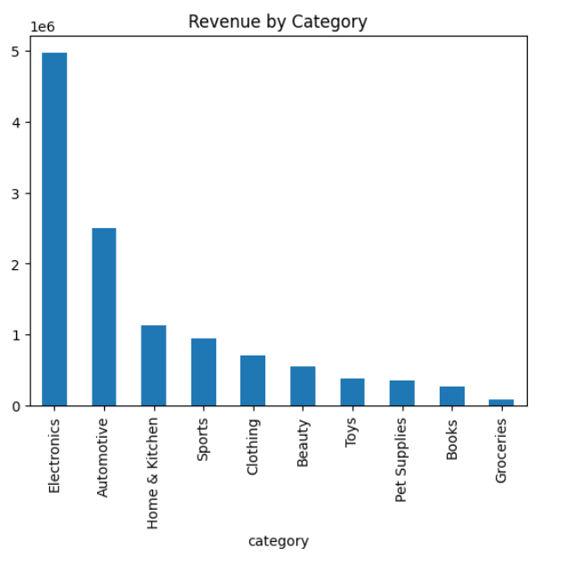

# E-Commerce Data Analysis

## Project Overview

This project analyzes a multi-table e-commerce dataset to understand sales performance, customer behavior, and product trends.
The goal is to extract meaningful insights using **SQL and Python** to support data-driven decision making in an online retail environment.

The dataset includes transactional, behavioral, and review data from an e-commerce platform.

---

## Dataset Source

The dataset used in this project was obtained from Kaggle:

https://www.kaggle.com/datasets/abhayayare/e-commerce-dataset

The dataset consists of multiple related tables representing different aspects of an online shopping platform.

---

## Dataset Tables

The analysis uses the following tables:

* **users** – customer information such as gender, city, and signup date
* **products** – product details including category, brand, price, and rating
* **orders** – order transactions and order status
* **order_items** – individual products included in each order
* **events** – user interactions such as product views and cart actions
* **reviews** – customer ratings and written feedback

---

## Tools & Technologies

* Python
* SQL
* Pandas
* Matplotlib
* Seaborn
* Jupyter Notebook

---

## Project Workflow

1. Data loading and exploration
2. Data cleaning and preprocessing
3. SQL analysis for business metrics
4. Exploratory data analysis using Python
5. Visualization of trends and patterns
6. Extraction of key business insights

---

## Analysis Performed

### Sales Analysis

* Total revenue calculation
* Average order value
* Monthly order trends

### Product Performance

* Top-selling products
* Revenue contribution by product categories
* Brand-level revenue analysis

### Customer Behavior

* Customer purchase frequency
* Identification of high-value customers

### Funnel Analysis

* Product view activity
* Cart actions
* User engagement patterns

### Review Analysis

* Rating distribution
* Average product ratings

---

## Visualizations

### Monthly Order Trend



### Revenue by Category



---

## Key Insights

* Certain product categories contribute significantly to total platform revenue.
* A small percentage of products generate a large share of total sales.
* Most customers make only one purchase, indicating opportunities to improve customer retention strategies.
* User engagement is highest at the product browsing stage, with fewer users proceeding to cart actions.
* Most product ratings fall within medium to high ranges, suggesting generally positive customer feedback.

---

## Project Structure

```
ecommerce-data-analysis
│
├── notebooks
│   ecommerce_analysis.ipynb
│
├── sql
│   ecommerce_queries.sql
│
├── images
│   order_trend.png
│   category_revenue.png
│
├── README.md
└── requirements.txt
```

---

## Conclusion

This analysis highlights important product trends, customer purchasing patterns, and engagement behaviors in the e-commerce platform.
The insights can help businesses optimize product strategies, improve marketing efforts, and enhance customer retention.
